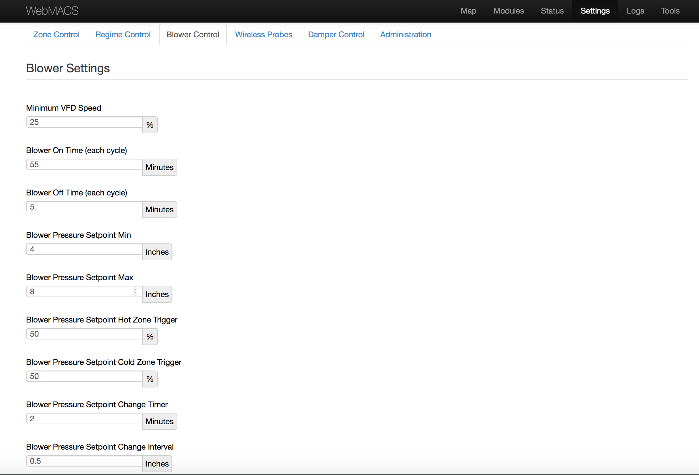
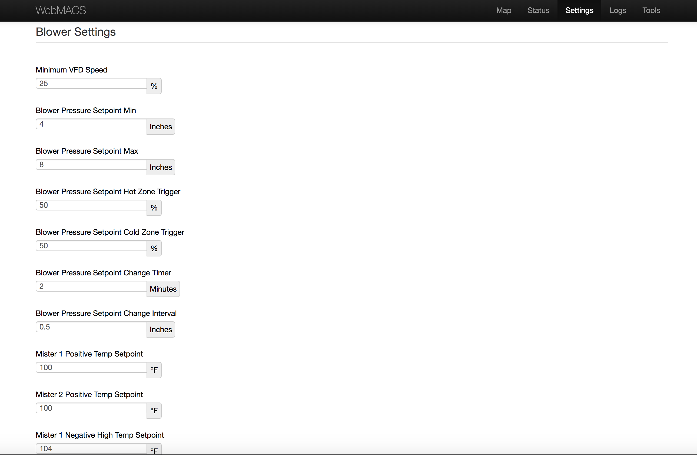
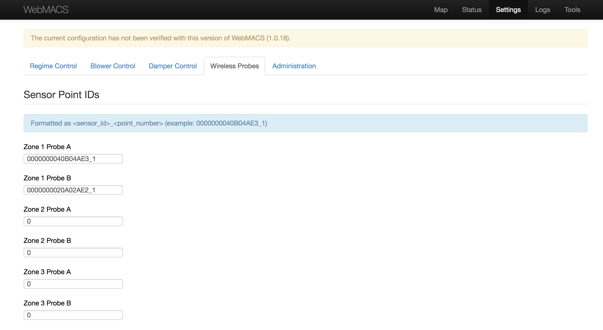
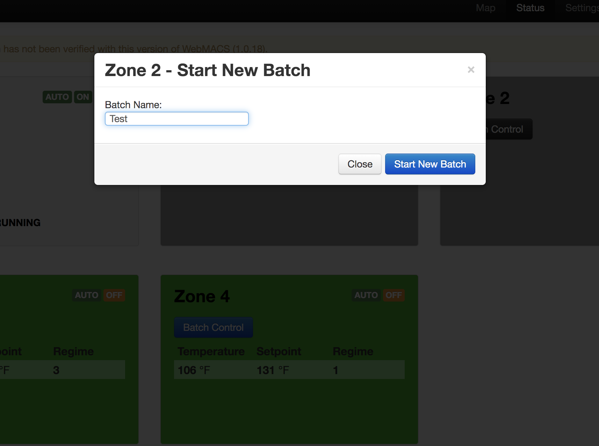
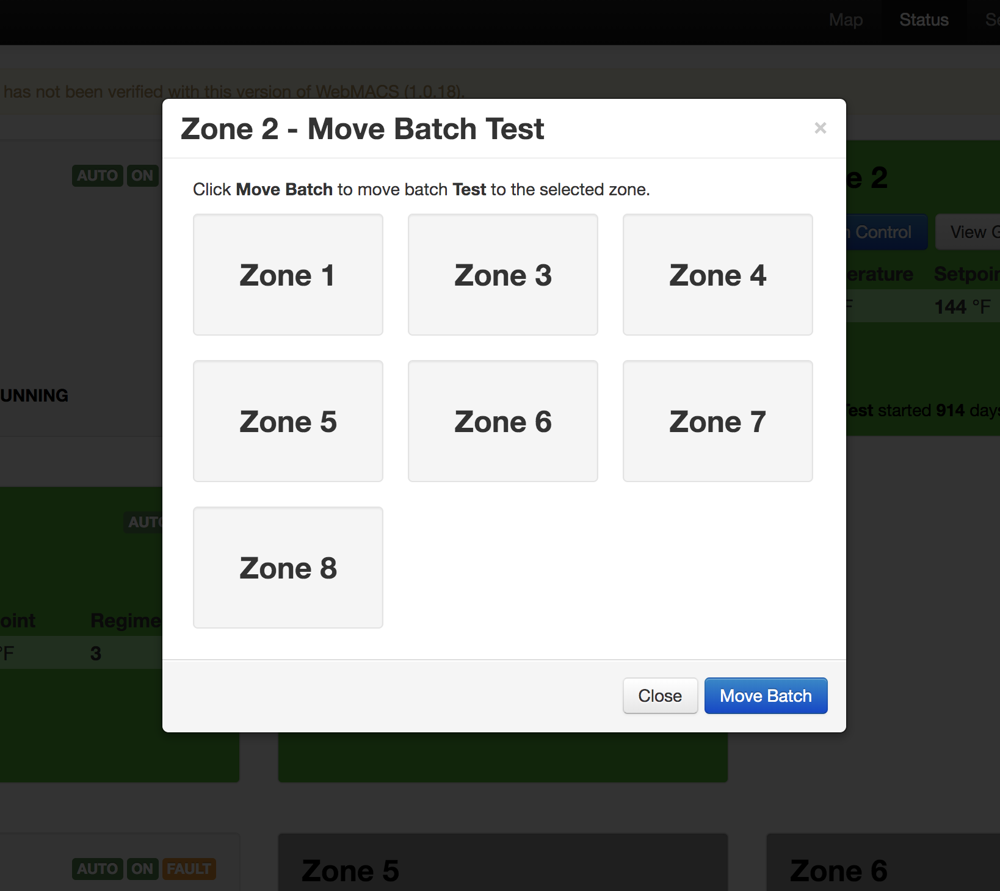
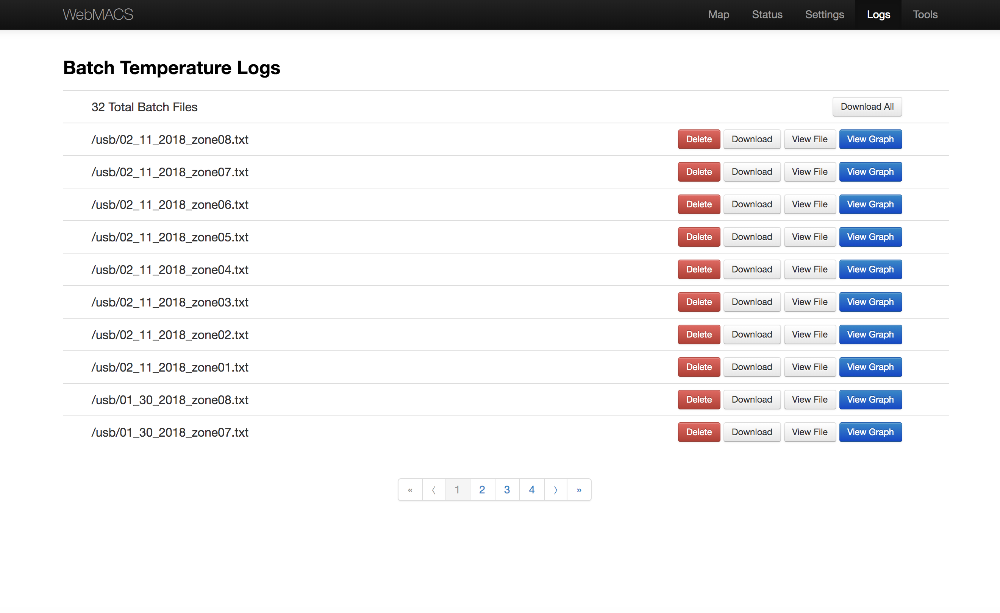
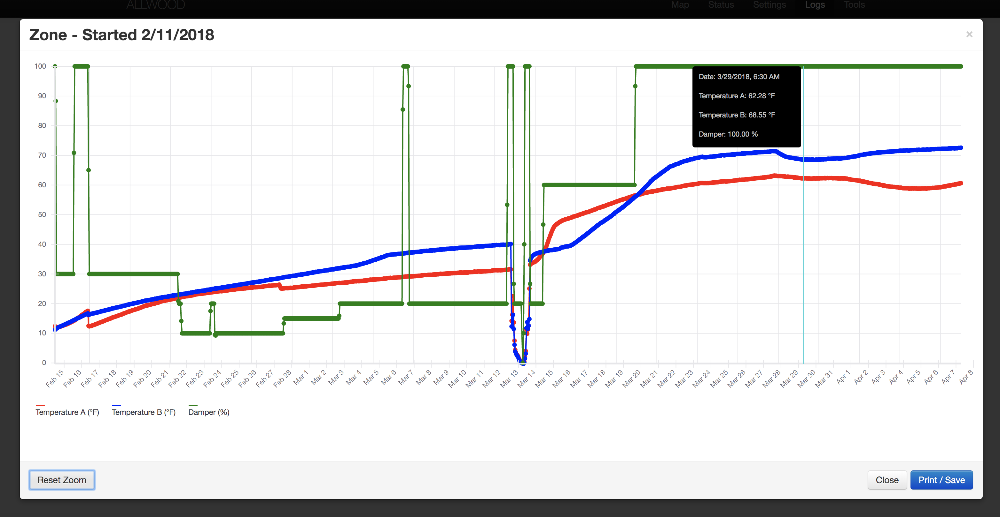
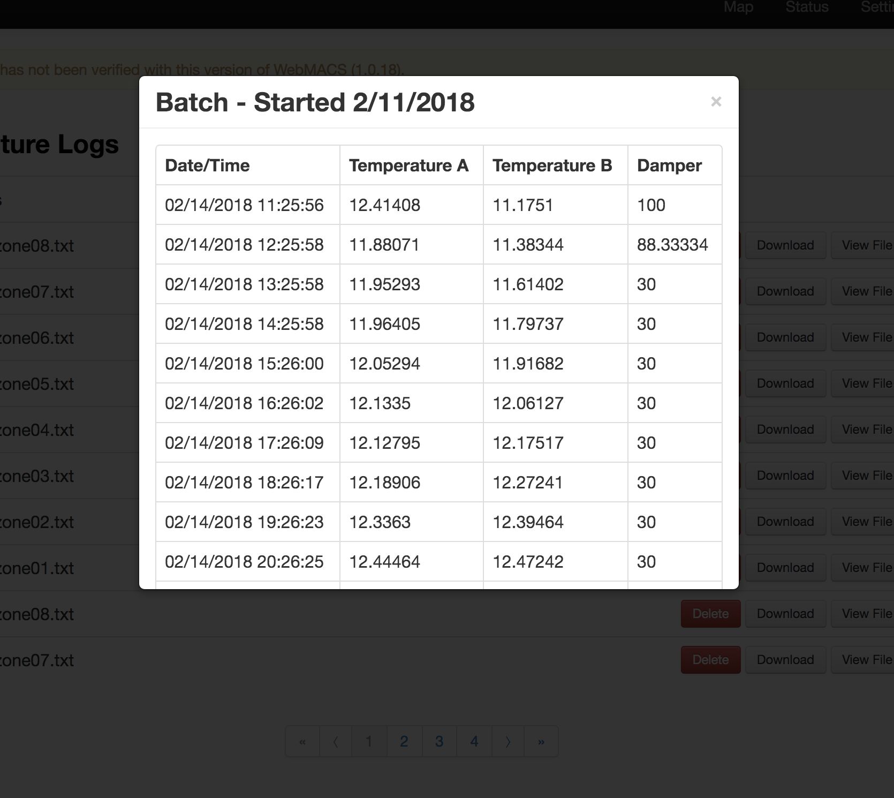
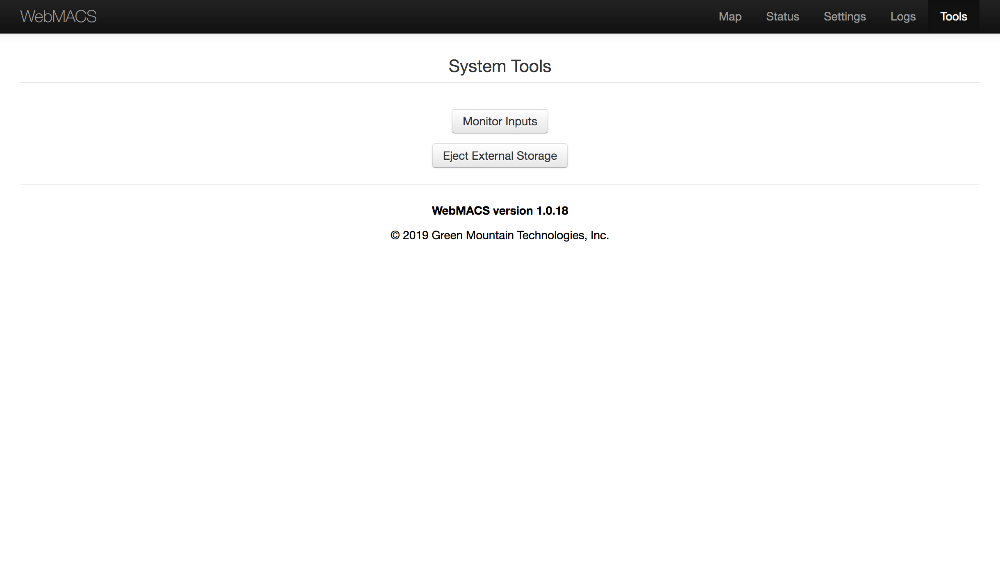
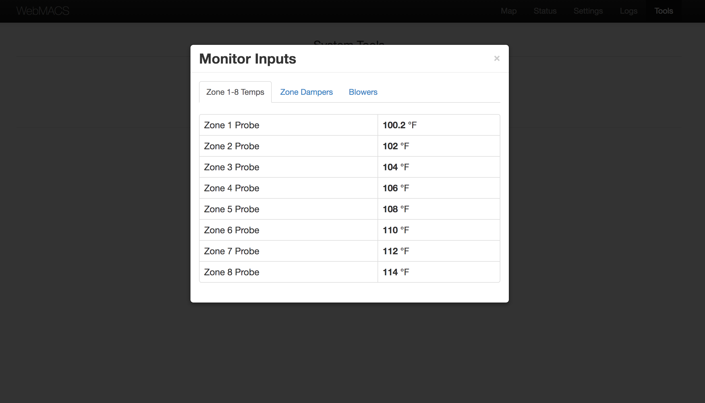

# WebMACS Features

- [System Types](#system-types)
  - [Single Direction Aeration Systems](#single-direction-aeration-systems)
  - [Reversing Direction Aeration Systems](#reversing-direction-aeration-systems)


- [System Features](#system-options)
  - [Temperature Based Zone Damper Control](#temperature-based-zone-damper-control)
  - [Temperature Based Blower Speed Control](#temperature-based-blower-speed-control)
  - [Pressure Based Blower Speed Control](#pressure-based-blower-speed-control)
  - [Temperature Based Mister Control](#temperature-based-mister-control)
  - [Temperature Sensors](#temperature-sensors)
  - [Duct Pressure Sensors](#duct-pressure-sensors)
  - [Aeration Direction Control](#aeration-direction-control)


- [Blower Control Logic Features](#blower-control-logic-options)
  - [Blower Direct Control Logic](#blower-direct-control-logic)
  - [Blower Temperature Control Logic](#blower-temperature-control-logic)
  - [Blower Pressure Control Logic](#blower-pressure-control-logic)
  - [Blower On/Off Temperature Control Logic](#blower-onoff-temperature-control-logic)
  - [Blower Direction Control Logic](#blower-direction-control-logic)


- [Batch Features](#batch-options)
  - [Batch Naming](#batch-naming)
  - [Moving Batches](#moving-batches)


- [Batch Log File Features](#batch-log-file-options)
  - [View Graph](#view-graph)
  - [View Log File](#view-log-file)
  - [Download Log File](#download-log-file)
  - [Delete Log File](#delete-log-file)
  - [Download All Log Files](#download-all-log-files)


- [Tools](#tools)
  - [Monitor Inputs](#monitor-inputs)
  - [Eject External Storage](#eject-external-storage)

## System Types

### Single Direction Aeration Systems
Single Direction Aeration Systems are standard systems in which aeration is meant to flow only in one direction. Configurations of this system type rely on blowers to be controlled by a blower control logic option such as [Blower Direct Control Logic](#blower-direct-control-logic), [Blower Temperature Control Logic](#blower-temperature-control-logic), [Pressure Based Blower Speed Control](#pressure-based-blower-speed-control), or [Blower On/Off Temperature Control Logic](#blower-onoff-temperature-control-logic). Other features for this system type include [Temperature Sensors](#temperature-sensors), [Temperature Based Zone Damper Control](#temperature-based-zone-damper-control), and [Duct Pressure Sensors](#duct-pressure-sensors).

#### Associated I/O
- 1 digital output for each blower on/off state
- 1 digital input for each blower fault state
- 1 0-5V analog output for each VFD to control blower speed
- 1 4-20mA analog output for each damper actuator
- 1 4-20mA analog input for each wired temperature sensor
- 1 4-20mA analog input for each duct pressure sensor
- 1 point manager for systems with wireless temperature sensors


### Reversing Direction Aeration Systems
Reversing Direction Aeration Systems are systems designed to allow for the aeration direction to be reversed. Configurations of this system type are dependent on [Aeration Direction Control](#aeration-direction-control) and other features including [Pressure Based Blower Speed Control](#pressure-based-blower-speed-control), [Temperature Based Mister Control](#temperature-based-mister-control), and [Temperature Based Zone Damper Control](#temperature-based-zone-damper-control).

#### Associated I/O
- 1 digital output for each blower on/off state
- 1 digital input for each blower fault state
- 1 digital output for each reversing h-damper
- 1 0-5V analog output for each VFD to control blower speed
- 1 4-20mA analog output for each damper actuator
- 1 4-20mA analog input for each wired temperature sensor
- 1 4-20mA analog input for each duct pressure sensor
- 1 digital output for each mister on/off state
- 1 point manager for systems with wireless temperature sensors

## System Features

### Temperature Based Zone Damper Control
Systems with Temperature Based Zone Damper Control contain damper actuators that are controlled programmatically based on zone temperatures. The rotation position of a damper is displayed as a percentage with 0% being closed and 100% being fully open. A minimum damper position value may be set by the user from within the *Settings* page.

### Temperature Based Blower Speed Control
Systems with Temperature Based Blower Speed Control allow for blower speeds to be adjusted programmatically based on temperature setpoints using [Blower Temperature Control Logic](#blower-temperature-control-logic) or [Blower On/Off Temperature Control Logic](#blower-onoff-temperature-control-logic). The speed of the blower is displayed as a percentage of maximum VFD speed. A minimum blower speed value may be set by the user from within the *Settings* page.

### Pressure Based Blower Speed Control
Systems with Pressure Based Blower Speed Control allow for blower speeds to be adjusted programmatically using [Blower Pressure Control Logic](#blower-pressure-control-logic) to control a blower based on a user defined blower pressure range that may be set from within the *Settings* page.


### Temperature Based Mister Control
Systems with Temperature Based Mister Control allow for misters to be toggled on and off based on temperature setpoints. The mister temperature setpoints may be set from within the *Settings* page.


### Temperature Sensors
Systems may use wired or wireless temperature probes for reading temperatures such as compost pile temperatures, duct temperatures, and biofilter temperatures. For systems using wireless temperature probes, a wireless point manager is required to read the data transmitted by the wireless temperature sensors. Wireless temperature sensor IDs may be assigned from within the *Settings* page.


### Duct Pressure Sensors
Systems may use pressure sensors for reading air pressure within ducts. The pressure reading is displayed as water column inches.

### Aeration Direction Control
Systems with Aeration Direction Control allow for the blower aeration direction to be adjusted programmatically based on temperature setpoints, aeration direction timers, and blower idle timers using [Blower Direction Control Logic](#blower-direction-control-logic). Positive and negative aeration direction timers and temperature setpoints may be set from within the *Settings* page.

## Blower Control Logic Features
All blower control logic features require relays for controlling the on/off state of a blower. Relays are also required for signaling blower faults. Systems with speed control require VFDs to control the speed of the blower. For blower direction control, a reversing h-damper is required.

### Blower Direct Control Logic
For systems with Blower Direct Control Logic, a blower is controlled by the ```blowerDirectControl``` function. The ```blowerDirectControl``` function is provided a ```target_speed``` value. The ```autoBlowerSpeedControl``` function is first used to check blower faults and manual overrides. If the blower has no faults, no manual overrides, and should run, this value is compared with the **MinVFDSpeed** setting that may be defined by the user. If the ```target_speed``` value is greater than the **MinVFDSpeed** setting, the VFD speed IO for that blower will be set to the ```target_speed```, otherwise, the VFD speed IO is set to the **MinVFDSpeed** value.

Facilities Using Blower Direct Control Logic:
- [Revolution Organics](../facilities/revolution_organics)

### Blower Temperature Control Logic
For systems with Blower Temperature Control Logic, a blower is controlled by the ```blowerTempControl``` function. The ```blowerTempControl``` function is provided average temperature values (```temp_average```) for the zone or zones that are associated with that blower and a temperature setpoint (```temp_setpoint```) setting that may be defined by the user. The ```autoBlowerSpeedControl``` function is first used to check blower faults and manual overrides. If the blower has no faults, no manual overrides, and should run, the VFD speed IO for that blower is then adjusted based on the ```temp_average``` and the ```temp_setpoint``` within the ```updateBlowerPIDValues``` function.

Facilities Using Blower Temperature Control Logic:
- [Old Dirt Hugger](../facilities/old_dirt_hugger)

### Blower Pressure Control Logic
For systems with Blower Pressure Control Logic, a blower is controlled by the ```blowerPressureControl``` function. The ```blowerPressureControl``` function is provided the current duct pressure value (```current_pressure```), the duct pressure setpoint (```pressure_setpoint```) that may be defined by the user, and the number of zones currently online (```zones_online```). The ```autoBlowerSpeedControl``` function is first used to check blower faults and manual overrides. If the blower has no faults, no manual overrides, and should run, the VFD speed IO for that blower is then adjusted based on the ```current_pressure```, ```pressure_setpoint```, and **BlowerRate** setting within the ```updateBlowerPIDPressureValues``` function.

Facilities Using Blower Pressure Control Logic:
- [Allwood](../facilities/allwood)
- [Blossom Valley](../facilities/blossom_valley)
- [Boost Organics](../facilities/boost_organics)
- [Dirt Hugger](../facilities/dirt_hugger)
- [Grimm's Fuel Expansion](../facilities/grimms_fuel_expansion)
- [Salinas](../facilities/salinas)
- [Vision Recycling](../facilities/vision_recycling)

### Blower On/Off Temperature Control Logic
For systems with Blower On/Off Temperature Control Logic, a blower is controlled by the ```blowerOnOffTempControl``` function. The ```blowerOnOffTempControl``` function is provided average temperature values (```temp_average```) for the zone or zones that are associated with that blower, a temperature setpoint (```temp_setpoint```) setting that may be defined by the user, and the number of zones currently online (```zones_online```). The ```autoBlowerSpeedControl``` function is first used to check blower faults and manual overrides. If the blower has no faults, no manual overrides, and any of the blower zones are online, the ```temp_average``` is greater than or equal to the ```temp_setpoint```, the blower will run based on **BlowerCycleOnTime** and **BlowerCycleOffTime** settings that may be defined by the user.

Facilities Using Blower Pressure Control Logic:
- [Olympic Organics](../facilities/olympic_organics)
- [Recompose Demo](../facilities/recompose_demo)
- [Stickland Farms](../facilities/stickland_farms)

### Blower Direction Control Logic
For systems with Blower Direction Control Logic, a blower's aeration direction is controlled by the ```blowerDirectionControl``` function. The ```blowerDirectionControl``` function is provided average temperature values (```temp_avg```) for the zone or zones that are associated with that blower, a temperature setpoint (```temp_sp```) value derived from the **BiofilterForcePositiveTemperature** setting that may be defined by the user, and the number of zones currently online (```zones_online```). If there are no manual aeration direction overrides, direction control timers are checked to determine if the blower direction should change. A reversing timer, which is based on the user defined settings **BlowerCyclePositiveTime** and **BlowerCycleNegativeTime**, for the current blower direction will be checked to see if the current direction timer has completed. The aeration direction will alternate based on reversing timers set from the **BlowerCyclePositiveTime** and **BlowerCycleNegativeTime** settings. If the reversing timer has completed, the blower idle timer will be set to force the blower speed time to wind down from the current blower speed to the **MinVFDSpeed** setting value, preventing a sudden blower direction change at high blower speeds which could incur damage. When half of the idle timer has completed, the reversing h-damper actuator will activate to change the blower direction. Once the idle timer has completed, the blower speed will ramp up to the blower speed that was set prior to the direction change. If at any point when the blower direction is in the negative aeration phase, the idletimer is at 0 and the ```temp_avg``` value is greater than the ```temp_sp``` value, the ```blowerDirectionControl``` function will set the reversing timer to 0 and reset the idle timer for the blower speed to wind down and change the blower direction to the positive aeration phase.

Facilities Using Blower Direction Control Logic:
- [Dirt Hugger](../facilities/dirt_hugger)
- [Grimm's Fuel Expansion](../facilities/grimms_fuel_expansion)
- [Blossom Valley](../facilities/blossom_valley) (Uses a custom version of Blower Direction Control Logic)

## Batch Features

### Batch Naming
When a batch is started, the user can provide a name for the batch, which is displayed within the zone card. The use of batch names provides the user an easier way to keep track of what batch is in each zone. Batch names are also included within the zone batch log filenames for easier reference within the list of zone log files found on the *Logs* page.


### Batch Moving
Batches may be started in one zone and then later moved to any other zone that does not currently have a started batch. When a batch is moved, all data logged while in the first zone remains in the batch log file as data continues to be logged in the zone the batch has been moved to. Each row of data logged includes a reference to the zone number the batch was in at the time the data was logged.


## Batch Log File Features


### View Graph
Batch log file data may be viewed on a graph. The legend items at the bottom of the graph can be clicked to toggle display of that specific data on the graph. By clicking and dragging within the graph, an area can be zoomed in on the graph more easily to distinguish between data points in large data sets. The current graph view may also be printed by clicking the Print/Save button.


### View Log File
Batch log file data may be viewed as a table of data with each row representing each time data was logged.


### Download Log File
Batch log file data may be downloaded as a ```.csv``` file with column headers as the first line of the file. Each line represents a row of data logged and each comma separated value represents the data for that column.

### Delete Log File
Batch log file data may be deleted. If a batch file is associated with a currently running batch, that batch will be stopped and the zone will be turned offline before deleting the file. Once deleted, the data cannot be recovered.

### Download All Log Files
For convenience, all batch log data files may be downloaded simultaneously as a ```.zip``` file.

## Tools Page


### Monitor Inputs
The Monitor Inputs tool is designed to allow the user to easily monitor IO inputs that have been defined in a facility's configuration. Example inputs that can be monitored are temperature probe readings, blower faults, blower on/off states, blower speeds, blower direction, pressure sensor readings, and damper positions.


### Eject External Storage
The Eject External Storage tool is designed to allow the user to eject the USB drive inserted in the X600 controller without visiting the X600 ```setup.html``` page. Using the Eject External Storage tool reduces the chance of causing database issues when removal of the USB drive is necessary. When this tool is used, all batches are ended, zones are turned offline, and data logging stops to allow the user to remove the USB drive.
