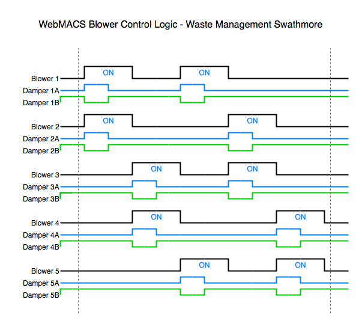

# Strathmore Control Logic

## Blower Groups & Sequences

The blower sequences are as follows:

- **Group 1:** 1, 2, 3, 4, 5

- **Group 2:** 6, 7, 8, 9, 10

Any blowers belonging to a zone that is offline will be removed from the active sequence for that group. Any blower that is set to run continually with the manual override will also be removed from the active sequence. If 2 or more blowers are set to run continually, all other blowers after the first two will remain off.

## Logic Steps

On each execution of the control loop (which will occur every 5 seconds), the following steps will be performed for the blowers in the active sequence for each group:

1. Stop any running blowers that have completed their alloted run time
2. Reset any damper pairs if their blower has completed 50% of its alloted time _(for blowers set to run continually, we will alternate damper positions based on ManualBlowerDamperCycleTime)_
3. If there are less than 2 blowers running and it has been 5 seconds since the last blower start or stop, start the next blower in the sequence
4. When a blower is started the corresponding damper A is opened and damper B is closed _(they will be reset after 50% of the blower time by step 2)_

## Time Settings

- **ManualBlowerDamperCycleTime:** Amount of time (in minutes) between damper position changes for blowers manually set to run continouosly
- **Blower01CycleOnTime:** Blower 1 on time in minutes
- **Blower02CycleOnTime:** Blower 2 on time in minutes
- **Blower03CycleOnTime:** Blower 3 on time in minutes
- **Blower04CycleOnTime:** Blower 4 on time in minutes
- **Blower05CycleOnTime:** Blower 5 on time in minutes
- **Blower06CycleOnTime:** Blower 6 on time in minutes
- **Blower07CycleOnTime:** Blower 7 on time in minutes
- **Blower08CycleOnTime:** Blower 8 on time in minutes
- **Blower09CycleOnTime:** Blower 9 on time in minutes
- **Blower10CycleOnTime:** Blower 10 on time in minutes
- **Blower01CycleOffTime:** Blower 1 off time in minutes
- **Blower02CycleOffTime:** Blower 2 off time in minutes
- **Blower03CycleOffTime:** Blower 3 off time in minutes
- **Blower04CycleOffTime:** Blower 4 off time in minutes
- **Blower05CycleOffTime:** Blower 5 off time in minutes
- **Blower06CycleOffTime:** Blower 6 off time in minutes
- **Blower07CycleOffTime:** Blower 7 off time in minutes
- **Blower08CycleOffTime:** Blower 8 off time in minutes
- **Blower09CycleOffTime:** Blower 9 off time in minutes
- **Blower10CycleOffTime:** Blower 10 off time in minutes
