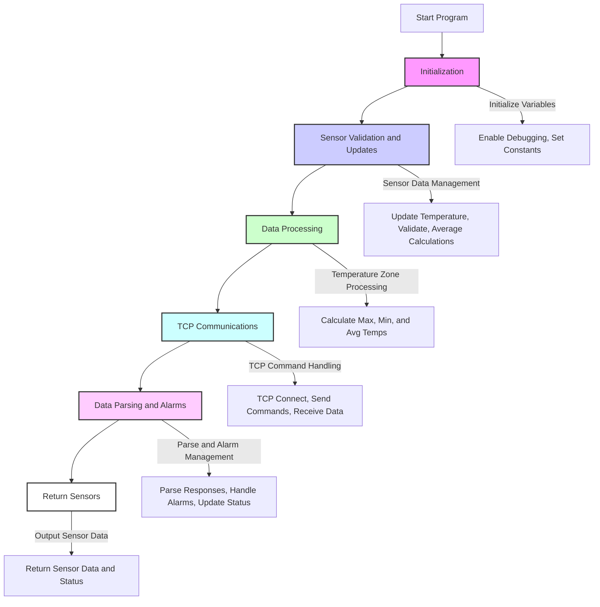

```mermaid
graph TD
    A[Start Program] --> B[Initialization]
    B --> C[Sensor Validation and Updates]
    C --> D[Data Processing]
    D --> E[TCP Communications]
    E --> F[Data Parsing and Alarms]
    F --> G[Return Sensors]

    B -->|Initialize Variables| init[Enable Debugging, Set Constants]
    C -->|Sensor Data Management| manage[Update Temperature, Validate, Average Calculations]
    D -->|Temperature Zone Processing| zoneProcess[Calculate Max, Min, and Avg Temps]
    E -->|TCP Command Handling| tcp[TCP Connect, Send Commands, Receive Data]
    F -->|Parse and Alarm Management| alarms[Parse Responses, Handle Alarms, Update Status]
    G -->|Output Sensor Data| output[Return Sensor Data and Status]

    style B fill:#f9f,stroke:#333,stroke-width:2px
    style C fill:#ccf,stroke:#333,stroke-width:2px
    style D fill:#cfc,stroke:#333,stroke-width:2px
    style E fill:#cff,stroke:#333,stroke-width:2px
    style F fill:#fcf,stroke:#333,stroke-width:2px
    style G fill:#fff,stroke:#333,stroke-width:2px

```