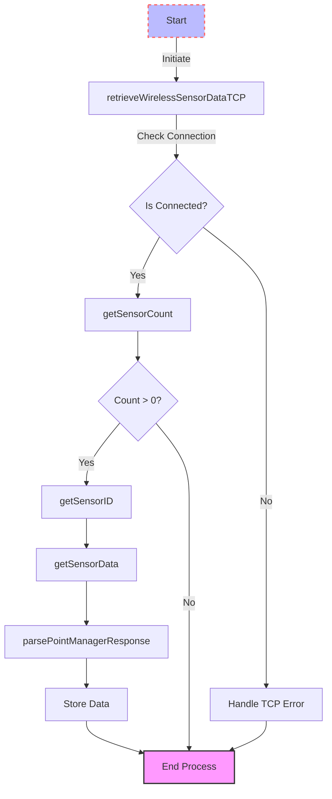

```mermaid
graph TD;
    A[Start] -->|Initiate| B[retrieveWirelessSensorDataTCP]
    B -->|Check Connection| C{Is Connected?}
    C -- Yes --> D[getSensorCount]
    D --> E{Count > 0?}
    E -- Yes --> F[getSensorID]
    F --> G[getSensorData]
    G --> H[parsePointManagerResponse]
    H --> I[Store Data]
    I --> J[End Process]
    E -- No --> J
    C -- No --> K[Handle TCP Error]
    K --> J

    style J fill:#f9f,stroke:#333,stroke-width:2px
    style A fill:#bbf,stroke:#f66,stroke-width:2px,stroke-dasharray: 5, 5
```