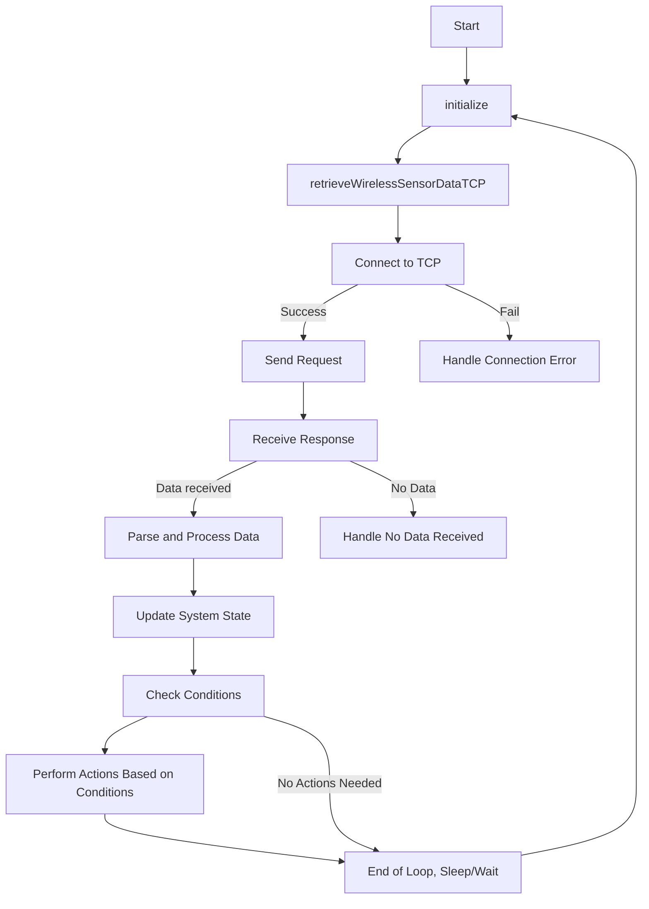

```mermaid
graph TD;
    A[Start] --> B[initialize];
    B --> C[retrieveWirelessSensorDataTCP];
    C --> D[Connect to TCP];
    D -->|Success| E[Send Request];
    D -->|Fail| X[Handle Connection Error];
    E --> F[Receive Response];
    F -->|Data received| G[Parse and Process Data];
    F -->|No Data| Y[Handle No Data Received];
    G --> H[Update System State];
    H --> I[Check Conditions];
    I --> J[Perform Actions Based on Conditions];
    J --> K[End of Loop, Sleep/Wait];
    K --> B;
    I -->|No Actions Needed| K;
```